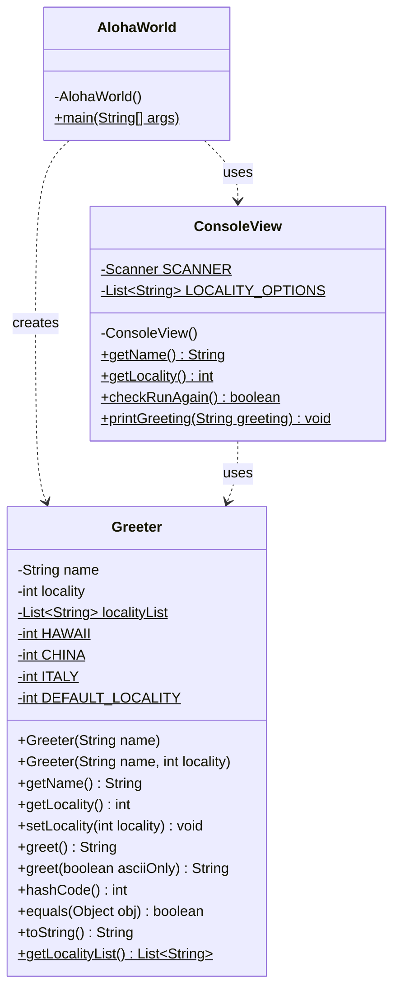

# Homework Aloha World Report

The following report contains questions you need to answer as part of your submission for the homework assignment. 

## Design Doc
Please link your UML design file here. See resources in the assignment on how to
link an image in markdown. You may also use [mermaid] class diagrams if you prefer, if so, include the mermaid code here.  You DO NOT have to include Greeting.java as part of the diagram, just the AlohaWorld application that includes: [AlohaWorld.java], [Greeter.java], and [ConsoleView.java].

### Program Flow
The program starts in `AlohaWorld.main()`, which is the entry point of the application. First, it calls `ConsoleView.getName()` to prompt the user for their name, then `ConsoleView.getLocality()` to have the user select a locality (e.g., Hawaii, USA, China, or Italy). A `Greeter` object is then created with the name and locality, and `greeter.greet()` is called to produce the greeting string, which is passed to `ConsoleView.printGreeting()` to display it. The program then enters a loop, repeatedly calling `ConsoleView.checkRunAgain()`; if the user says yes, a new locality is selected and a new greeting is printed, continuing until the user chooses to stop.

## Assignment Questions

1. List three additional java syntax items you didn't know when reading the code.  (make sure to use * for the list items, see example below, the backtick marks are used to write code inline with markdown)
   
   * (example) `final class`
   * `@Override`
   * `this(...)` constructor chaining
   * `static final` constants

2. For each syntax additional item listed above, explain what it does in your own words and then link a resource where you figured out what it does in the references section. 

    * (example) The `final` keyword when used on a class prevents the class from being subclassed. This means that the class cannot be extended by another class. This is useful when you want to prevent a class from being modified or extended[^1] . It is often the standard to do this when a class only contains static methods such as driver or utility classes. Math in Java is an example of a final class[^2] .

    * The `@Override` annotation tells the compiler that the method below it is intentionally overriding a method from a parent class (such as `Object`). If the method signature does not actually match a parent method, the compiler will throw an error. This is useful because it catches typos or incorrect method signatures at compile time rather than silently creating a new unrelated method[^3].

    * Constructor chaining using `this(...)` allows one constructor to call another constructor in the same class. In `Greeter`, the single-argument constructor calls `this(name, DEFAULT_LOCALITY)`, passing through to the two-argument constructor. This avoids duplicating initialization logic across multiple constructors and keeps the code DRY (Don't Repeat Yourself)[^4].

    * A `static final` field is a constant that belongs to the class itself rather than any instance, and whose value cannot be changed after it is assigned. In `Greeter`, fields like `HAWAII = 1` are `static final`, meaning every `Greeter` object shares the same constant value and nobody can accidentally reassign it. By convention these fields are written in ALL_CAPS[^5].

3. What does `main` do in Java? 

    The `main` method is the entry point of any Java application. When the Java Virtual Machine (JVM) runs a program, it searches for and calls `public static void main(String[] args)` first. It must be `public` so the JVM can access it from outside the class, `static` so it can be called without creating an object of the class, and `void` because it does not return a value. The `String[] args` parameter allows optional command-line arguments to be passed to the program at startup.

4. What does `toString()` do in Java? Why should any object class you create have a `toString()` method?

    `toString()` is a method inherited from Java's `Object` class that returns a human-readable string representation of an object. By default the inherited version returns something unhelpful like a memory address (e.g. `student.Greeter@1b6d3586`). Overriding it, as `Greeter` does to produce `{name:"Kailani", locality:"Hawaii"}`, gives a meaningful description of the object's state. Every class should override `toString()` because it makes debugging much easier — you can print an object directly to the console and immediately see its contents rather than a cryptic reference.

5. What is javadoc style commenting? What is it used for? 

    Javadoc-style comments begin with `/**` and end with `*/` and are placed directly above classes, methods, and fields. Inside them you can use special tags such as `@param` to describe method parameters, `@return` to describe what a method returns, and `@author` to credit the author. The JDK's `javadoc` tool reads these comments and automatically generates professional HTML documentation pages (similar to the official Java API docs). This is the standard way to document public APIs in Java, as seen throughout `Greeter.java` and `ConsoleView.java`.

6. Describe Test Driving Development (TDD) in your own words. 

    Test Driven Development (TDD) is a development practice where you write an automated test *before* you write the actual code that satisfies it. The cycle goes: (1) write a test that fails because the feature does not yet exist — "red"; (2) write just enough code to make the test pass — "green"; (3) refactor the code to clean it up while keeping all tests passing — "refactor". Repeating this red-green-refactor loop ensures that every piece of code is immediately covered by a test, makes requirements explicit upfront, and results in a suite of tests that guards against future regressions.    

7. Go to the [Markdown Playground](MarkdownPlayground.md) and add at least 3 different markdown elements you learned about by reading the markdown resources listed in the document. Additionally you need to add a mermaid class diagram (of your choice does not have to follow the assignment. However, if you did use mermaid for the assignment, you can just copy that there). Add the elements into the markdown file, so that the formatting changes are reserved to that file. 

## Deeper Thinking Questions

These questions require deeper thinking of the topic. We don't expect 100% correct answers, but we encourage you to think deeply and come up with a reasonable answer. 

1. Why would we want to keep interaction with the client contained to ConsoleView?

    Keeping all user interaction inside `ConsoleView` is an application of the **Separation of Concerns** principle. `Greeter` only knows how to produce a greeting string — it has no idea how the greeting is displayed or how input is collected. If we ever wanted to change the interface (for example, swap the console for a graphical window or a web form), we would only need to rewrite `ConsoleView` without touching `Greeter` or `AlohaWorld`. It also makes testing easier: we can unit-test `Greeter`'s logic in complete isolation without any console interaction. Overall it keeps each class focused on a single responsibility, making the code easier to understand, maintain, and extend.

2. Right now, the application isn't very dynamic in that it can be difficult to add new languages and greetings without modifying the code every time. Just thinking programmatically,  how could you make the application more dynamic? You are free to reference Geeting.java and how that could be used in your design.

    The `Greeting.java` class already provides a clean data model that stores a locality ID, locality name, ascii greeting, unicode greeting, and a format string — everything needed to describe any greeting without hardcoding it. To make the application fully dynamic, we could store a collection of `Greeting` objects (e.g., a `List<Greeting>`) and load them at startup from an external source such as a JSON or CSV file. `Greeter` would then look up the correct `Greeting` by locality ID instead of using a `switch` statement. Adding a new language would only require adding a new row to the data file — no Java code changes at all. `ConsoleView` would dynamically build its menu by iterating over the loaded `Greeting` objects, so the UI would update automatically as well.

> [!IMPORTANT]
>  After you upload the files to your github (ideally you have been committing throughout this progress / after you answer every question) - make sure to look at your completed assignment on github/in the browser! You can make sure images are showing up/formatting is correct, etc. The TAs will actually look at your assignment on github, so it is important that it is formatted correctly.

## References

[^1]: Final keyword in Java: 2024. https://www.geeksforgeeks.org/final-keyword-in-java/. Accessed: 2024-03-30. 

[^2]: Math (Java Platform SE 17). https://docs.oracle.com/en/java/javase/17/docs/api/java.base/java/lang/Math.html. Accessed: 2024-03-30.

[^3]: @Override Annotation in Java. https://www.geeksforgeeks.org/overriding-in-java/. Accessed: 2026-06-12.

[^4]: Constructor Chaining in Java. https://www.geeksforgeeks.org/constructor-chaining-java-examples/. Accessed: 2026-06-12.

[^5]: Static and Final keywords in Java. https://www.geeksforgeeks.org/static-keyword-java/. Accessed: 2026-06-12.

<!-- This is a comment, below this link the links in the document are placed here to make ti easier to read. This is an optional style for markdown, and often as a student you will include the links inline. for example [mermaid](https://mermaid.js.org/intro/syntax-reference.html) -->
[mermaid]: https://mermaid.js.org/intro/syntax-reference.html
[AlohaWorld.java]: src/main/java/student/AlohaWorld.java
[Greeter.java]: src/main/java/student/Greeter.java
[ConsoleView.java]: src/main/java/student/ConsoleView.java